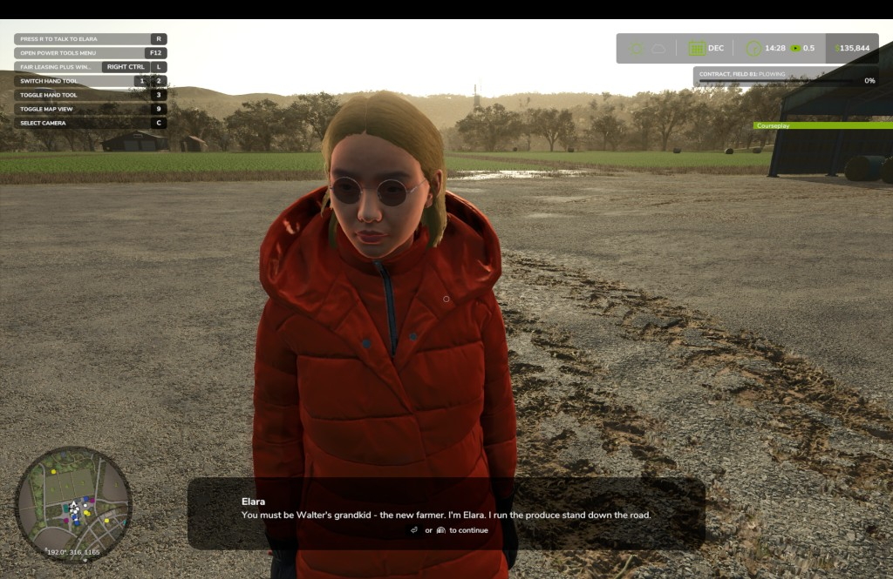
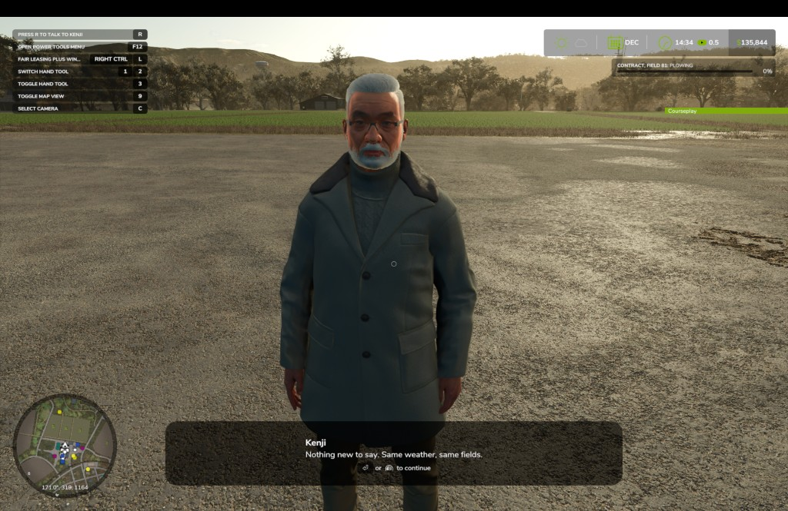

# Farm Sim Valley 🌅

A Farming Simulator 25 mod that aims to recreate the experience of some of our favorite games like Harvest Moon and Stardew Valley where farming is integrated into a living narrative. This mod adds authored villagers, relationship progression,
and scripted heart events to the social layer of the game. Built for **Riverbend
Springs**, **singleplayer** career mode. More developments are on their way.

**Current version:** 0.1.0.42 (`modDesc.xml`)

## Screenshots





## What it does (so far)

- **Three villagers** - Elara, Kenji, and Marta - spawned as animated humans using
  the base-game character rig (`HumanGraphicsComponent`), with per-season work and
  leisure outfits.
- **Press R to talk** when you are within range. Daily greetings build relationship;
  higher tiers unlock **heart events** (branching dialogue scenes).
- **Calendar-driven outfits** - work clothes Mon–Fri 5:30 AM–4:30 PM (excluding
  holidays); leisure on evenings, weekends, and holidays. Season changes swap
  baked summer / fall / winter / spring layers automatically.
- **Bottom-screen dialogue** - custom narration popup and reply selector (not
  centred modals), drawn each frame on the mission HUD pass.
- **Save data** - relationships and completed events persist in
  `{savegame}/valleyLife.xml`.

Multiplayer is not supported (`modDesc.xml`).

## Requirements

- Farming Simulator 25
- **Riverbend Springs** map

## Install (players)

1. Copy `FS25_ValleyLife.zip` into your mods folder:
   - macOS: `~/Library/Application Support/FarmingSimulator2025/mods/`
   - Windows: `Documents/My Games/FarmingSimulator2025/mods/`
2. Enable the mod in the mod manager and start or load a **career** save.
3. Confirm in `log.txt`: `Valley Life 0.1.0.42 loaded`.

## Controls

| Input | Action |
|-------|--------|
| **R** | Talk to nearest villager (within ~3 m) |
| **↑ / ↓** | Navigate reply choices (heart events only) |
| **Enter** or **click** | Continue dialogue / confirm choice |

## Development

FS25 loads the **zip in Application Support**, not this repo folder directly.

```bash
./repack.sh
```

That writes `~/Library/Application Support/FarmingSimulator2025/mods/FS25_ValleyLife.zip`
(excludes `journals/`, git metadata, and local editor folders). **Fully quit and
relaunch** the game after repacking.

Open the developer console with **`~`** for `vl*` debug commands (`vlPos`, `vlOutfit`,
`vlEvent`, clothing tuners, etc.). See [journals/console-commands.md](journals/console-commands.md).

### Project layout

```
main.lua              Entry point - sources modules, hooks mission lifecycle
modDesc.xml           Mod metadata, input bindings, version
src/
  NPCSystem.lua       Coordinator - villagers, save/load, update loop
  NPCConfig.lua       Distances, relationship tiers, spawn coords, holidays
  scripts/
    NPCEntity.lua     Spawn, appearance, idle animation, outfit merge
    NPCEventSequencer.lua  Heart event playback
    NPCRelationshipManager.lua
    NPCScheduler.lua  (time labels; schedule hooks planned)
  gui/NPCDialog.lua   Speech box, reply selector, Press-R prompt
  content/            Per-villager heart event definitions
  utils/              Time, birthdays, outfit calendar
journals/             Developer reference (not shipped in the mod zip)
repack.sh             Build mod zip for local testing
```

### Developer docs

Detailed notes live under **[journals/](journals/README.md)**:

| Topic | File |
|-------|------|
| Mission hooks & animation | [lifecycle-and-hooks.md](journals/lifecycle-and-hooks.md) |
| Outfits & calendar | [outfits-and-schedule.md](journals/outfits-and-schedule.md) |
| Appearance & baking | [character-appearance.md](journals/character-appearance.md) |
| Console commands | [console-commands.md](journals/console-commands.md) |
| Dialog UI | [dialog-boxes.md](journals/dialog-boxes.md) |

Bake outfit indices in `src/NPCSystem.lua` (`VILLAGERS`); console tweaks are
live-only until repacked.

### Logs

macOS log path:

`~/Library/Application Support/FarmingSimulator2025/log.txt`

Look for `[ValleyLife]` lines - spawn confirmations, outfit transitions, animation
setup (`idle animation: … (direct track)`), and errors.

## Status

Early development. Heart events exist for all three villagers; camera takeover
during events is still a stub. Birthday → leisure-all-day is not implemented yet.

## License

Not specified - add a license if you plan to distribute beyond personal use.
